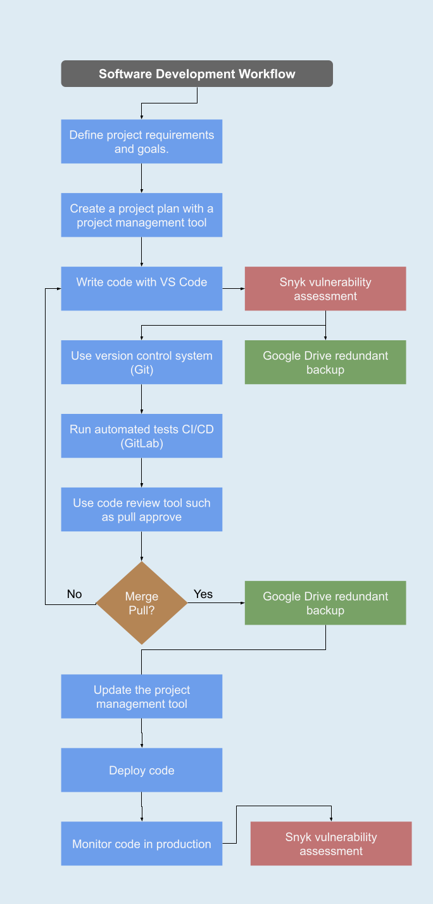

# boejaker.github.io 
### A portfolio of programming examples, website templates &amp; more!      

***
 

## Problem Statement
Employers and collaborators do not have an easy way to view or experience my work. Github is good for version control but lacks substance.  
I post my work to multiple platforms, social media and blogs, this makes it hard to see all my content without lots of searching.

***
   

## Solution
A single webpage that aggregates all of my content and posts automatically.   
List and summarize my most notable repos automatically with javascript API calls to github
Interactive sections that run deployed code.
A section that contains my contact details and a dynamic CV element that updates as i update the google doc

With these features i will be able to keep posting to my other platforms as i was with all new content automatically displaying on the portfolio.

***
   

## Design Specification
Must be easy to use on both PC and Mobile (responsive).  
Must provide my contact details in several places - uses animation to draw the eye to at least one.  
A distinct, clashing, color pallette.

This should create an easy to use, memorable, experience.

***
   

## Implementation
Minimal use of libraries, use my own code wherever feasible.

   

## Development Workflow

***
 

## Testing & Deployment

### Unit Test
Files / Folders:
jest.config.js
babel.config.js

This website has unit test that have been designed for it.
To run the unit tests pull the repository, then open a terminal in that directory and type the following:  

    yarn install

    yarn test

These test check that the website renders correctly and the javascript behaves as intended. It is designed as a pre pull/push check, ensuring you have not changed the layout accidentally whilst editing the source.

 

### Deployment Test
Files / Folders:
website_test.py
dockerfile

The deployment tests run as a scheduled docker container on a server. They check that my websites in production are operating as expected.

    docker build website_test .

    docker run -ti website_test
***
   

## Conclusion

