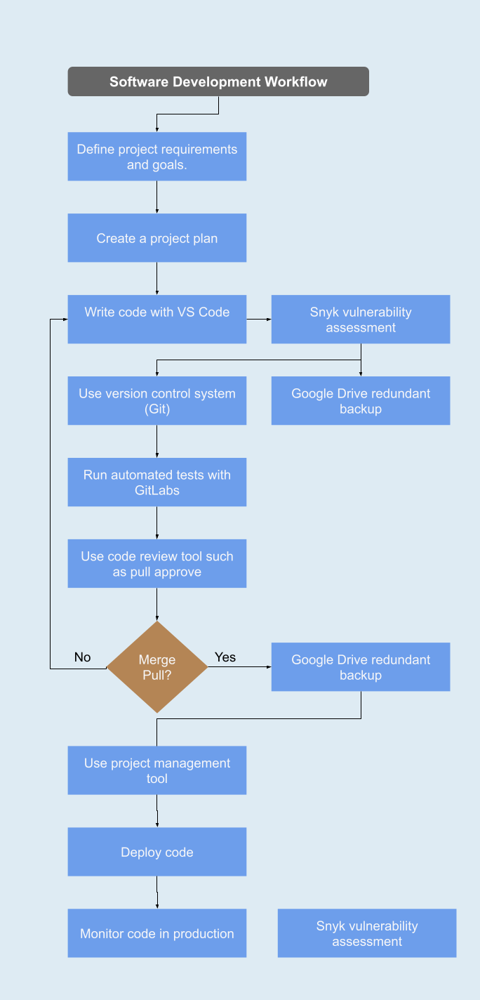

# boejaker.github.io 
A portfolio of programming examples, website templates &amp; more!     
 

## Problem statement
Employers and collaborators do not have an easy way to view or experience my work. Github is good for version control but lacks substance.  
I post my work to multiple platforms, social media and blogs, this makes it hard to see all my content without lots of searching.

   

## Solution
A single webpage that aggregates all of my content and posts automatically.   
Interactive sections that run deployed code.

   

## Design Specification
Must be easy to use on both PC and Mobile (responsive).  
Must provide my contact details in several places - uses animation to draw the eye to at least one.

   

## Implementation
Minimal use of libraries, use my own code wherever feasible.

   

## Development Workflow

 

## Unit Test
This website has unit test that have been designed for it.
To run the unit tests pull the repository, then open a terminal in that directory and type the following:  

    yarn install

    yarn test

 

## Conclusion

Thank you for taking the time to read this. I look forward to connecting with others who share my passion for programming and cyber security.  
